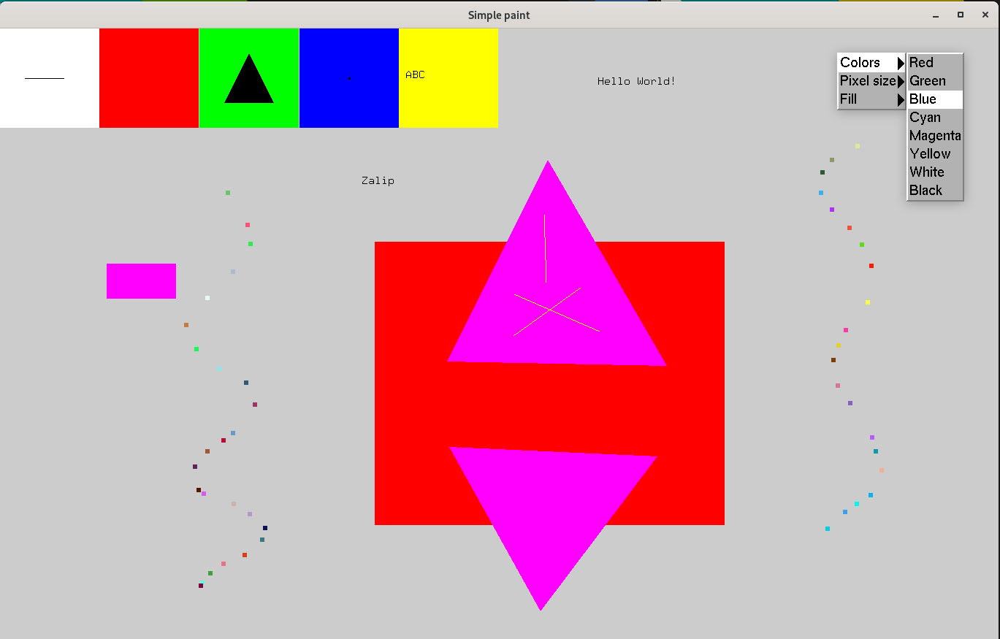

# SimplePaint
A simple drawing program. OpenGL, GLUT.

## Usage
- `$> make SimplePaint`
- `$> ./Simplapaint`
- The right mouse button opens a menu with options to clear the screen and quit.
- The middle mouse button opens a menu with options for changing the color, pixel size, and form filling.
- To select a graphic primitive, click on one of the squares at the top of the screen. Available primitives: line, rectangle, triangle, pixel and text.
  
